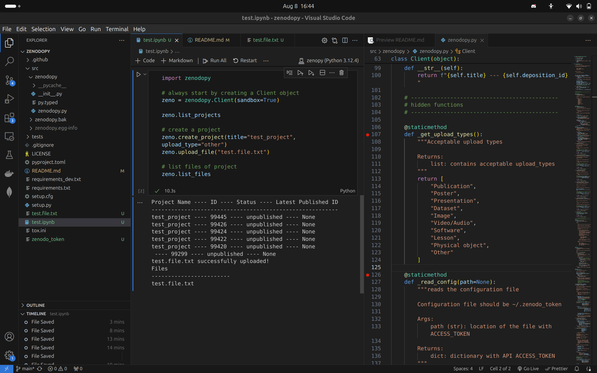

# zenodopy


[](https://codecov.io/gh/lgloege/zenodopy)
[](https://pypi.org/project/zenodopy)
[](https://opensource.org/licenses/MIT)
[](https://github.com/lgloege/zenodopy/issues)

### Project under active deveopment, not production ready

A Python 3.6+ package to manage [Zenodo](https://zenodo.org/) repositories.


### Dev Setup

#### Step 1: Clone the repository
```
git clone https://github.com/lgloege/zenodopy.git
cd zenodopy
```

#### Step 2: Create and activate a conda environment
```
conda create --name zenopy python=3.9
conda activate zenopy
```

#### Step 3: Install the dependencies
```
pip install -r requirements.txt
```

#### Step 4: Install the package in editable mode
```
pip install -e .
```



### Functions Implemented

- `.create_project()`: create a new project
- `.upload_file()`: upload file to project
- `.download_file()`: download a file from a project
- `.delete_file()`: permanently removes a file from a project
- `.get_urls_from_doi()`: returns the files urls for a given doi


Notes
-----

This project is under active development. Here is a list of things that needs improvement:

- **more tests**: need to test uploading and downloading files
- **documentation**: need to setup a readthedocs
- **download based on DOI**: right now you can only download from your own projects. Would be nice to download from
- **asyncronous functions**: use `asyncio` and `aiohttp` to write async functions. This will speed up downloading multiple files.

### Dev Setup

#### Step 1: Clone the repository
```
git clone https://github.com/lgloege/zenodopy.git
cd zenodopy
```

#### Step 2: Create and activate a conda environment
```
conda create --name zenopy python=3.9
conda activate zenopy
```

#### Step 3: Install the dependencies
```
pip install -r requirements.txt
```

#### Step 4: Install the package in editable mode
```
pip install -e .
```
